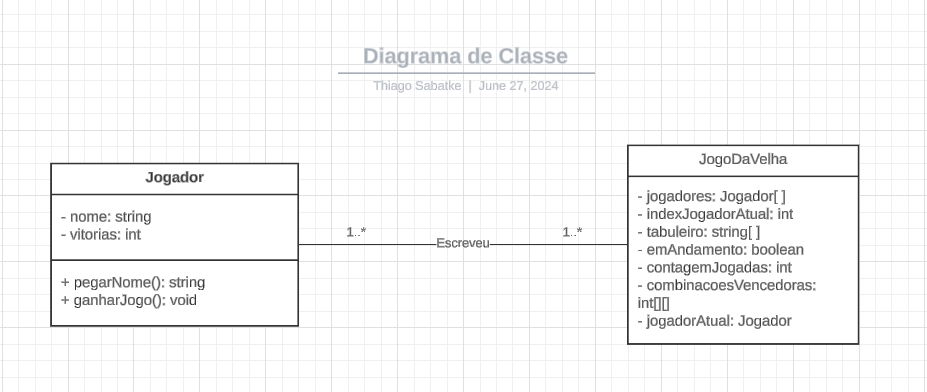

# Projeto Jogo Da Velha 

## Sobre
Este projeto implementa o clássico jogo da velha utilizando JavaScript orientado a objetos.

## Tecnologias Utilizadas

- **HTML**
- **CSS**
- **JavaScript**

## Participantes
- Thiago Sabatke - RA: 23094761-2
- Cassiano Arthur - RA: 23091226-2
- Gustavo Da Rocha - RA: 23190397-2

# Dificuldades

Implementação da lógica de alternar entre jogadores durante o jogo, salvar os dados no armazenamento local e a integração com o sistema de ranking, e desenvolver o projeto com a equipe usando o versionamento de codigo.

# Diagrama de Classe
